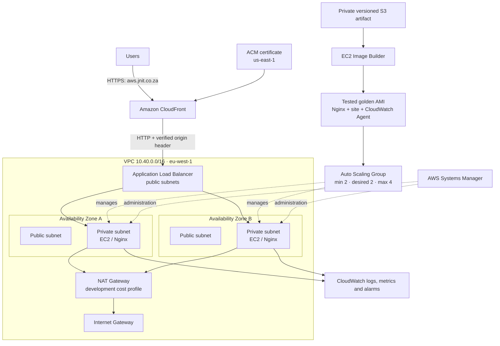
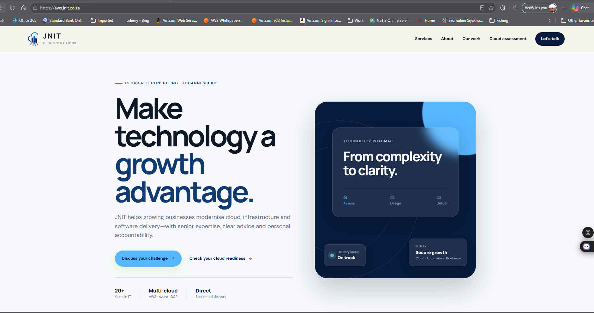
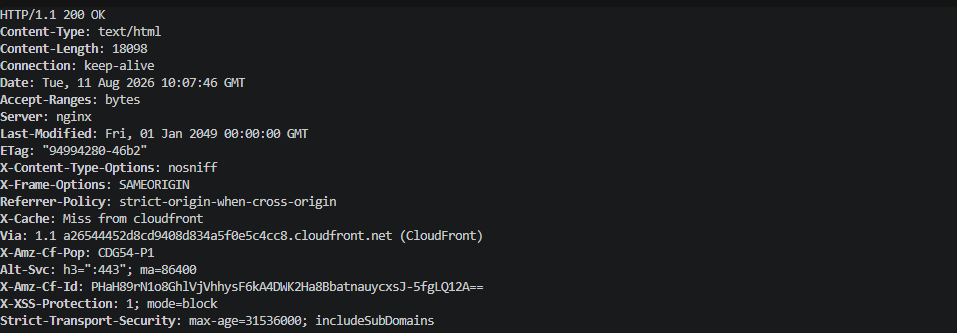
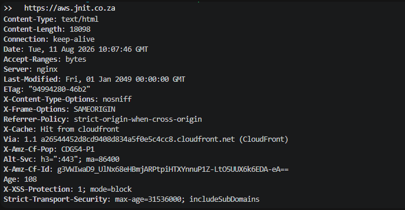
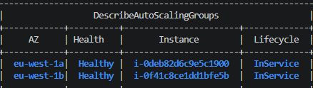
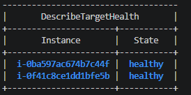
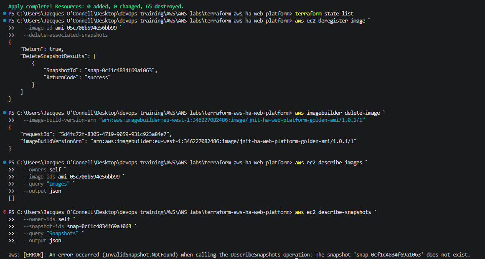

# Highly Available AWS Web Platform

[](https://developer.hashicorp.com/terraform)
[](https://aws.amazon.com/)
[](#cost-control-and-cleanup)

A production-style, highly available web platform built on AWS with Terraform. The project packages the JNIT Cloud Solutions website into a tested golden AMI, distributes traffic through CloudFront and an Application Load Balancer, and runs two private EC2 web servers under Auto Scaling across two Availability Zones.

The environment was deployed, verified through its custom HTTPS domain, resilience-tested by terminating an instance, and completely destroyed after evidence was captured.

## What this demonstrates

- Immutable delivery with EC2 Image Builder and a tested Amazon Linux 2023 golden AMI
- Multi-AZ networking with public and private application tiers
- Automatic instance recovery and capacity management with EC2 Auto Scaling
- Edge delivery, HTTPS and caching with CloudFront and ACM
- Restricted origin access using the CloudFront managed prefix list and a secret origin header
- Centralised Nginx logs, host metrics and operational alarms in CloudWatch
- SSM administration without inbound SSH
- Account guardrails, encrypted storage, IMDSv2 and least-privilege traffic paths
- Repeatable deployment and complete teardown using Terraform

## Architecture



## Request and trust path

| Layer | Control |
|---|---|
| Viewer | CloudFront redirects HTTP to HTTPS and uses an ACM certificate for the custom domain |
| Edge | Price Class 100, HTTP/2 and HTTP/3, managed response headers and a custom cache policy |
| Origin | The ALB accepts port 80 only from AWS's CloudFront origin-facing managed prefix list |
| Forwarding | The ALB default action is `403`; only requests with the CloudFront origin-verification header are forwarded |
| Web tier | EC2 security group accepts port 80 only from the ALB security group |
| Administration | No SSH ingress; instances register with Systems Manager using an IAM instance profile |
| Host | Encrypted gp3 root volumes, IMDSv2 required, Nginx version tokens disabled |

## Golden AMI pipeline

EC2 Image Builder creates the immutable server image before the application tier is launched:

1. Retrieves the versioned website archive from a private, encrypted S3 bucket.
2. Installs Nginx, unzip and the Amazon CloudWatch Agent.
3. Deploys the website and writes hardened Nginx configuration.
4. Configures Nginx access/error log collection and memory/disk metrics.
5. Validates Nginx, the agent configuration, files and enabled services.
6. Tests `/health`, verifies the website content and confirms the agent binary.
7. Publishes a tagged AMI used by the EC2 launch template.

The first build exposed Windows CRLF characters inside generated Linux commands. AWSTOE logs in S3 showed `$'\r': command not found` and an invalid `nginx\r.service` name. Version `1.0.1` fixed this by using single-line Image Builder commands and base64-encoding generated configuration before decoding it on Linux. The replacement build passed its build, validation and test phases.

## Deployment phases completed

| Phase | Outcome | Recorded Terraform activity |
|---|---|---:|
| 1. Artifact foundation | Private, encrypted and versioned S3 website artifact | 5 added |
| 2. Image Builder identity | Build role, policies and instance profile | 5 added |
| 3. Image component | Nginx, website and CloudWatch build/validate/test document | 1 added |
| 4. Network | Two-AZ VPC, four subnets, routes, IGW and one development NAT Gateway | 16 added |
| 5. Image pipeline | Recipe, infrastructure/distribution configuration and pipeline | Deployed, then versioned during repair |
| 6. Runtime operations | EC2 role/profile, SSM and retained CloudWatch log groups | 6 added |
| 7. Load balancing | CloudFront-restricted ALB, target group, health checks and origin verification | 13 added |
| 8. Compute | Launch template, two-instance ASG and CPU target tracking | 3 added |
| 9. Monitoring | SNS topic and five CloudWatch alarms | 6 added |
| 10. Edge and DNS | ACM validation, CloudFront policies/distribution and `aws.jnit.co.za` | 4 added after certificate issuance |
| 11. Cleanup | All Terraform-managed infrastructure removed | 65 destroyed |

The build-created AMI, EBS snapshot and Image Builder image record were also explicitly removed because they are not lifecycle-managed by the Terraform pipeline resource.

## Verification performed

- Two ASG instances ran in different Availability Zones and became healthy ALB targets.
- Both instances registered as online Systems Manager managed nodes.
- CloudWatch Agent published `mem_used_percent` and `disk_used_percent` metrics.
- Nginx error and access log streams were created per instance.
- The custom URL returned `HTTP 200` with HSTS, frame, content-type and referrer controls.
- The first edge request returned `Miss from cloudfront`; the repeated request returned `Hit from cloudfront`.
- One EC2 instance was deliberately terminated. Auto Scaling launched a new instance, restored desired capacity to two and registered the replacement as healthy while the website remained available.
- The final destroy removed 65 Terraform resources; subsequent checks confirmed the AMI and snapshot were deleted separately.

## Evidence

### Custom HTTPS domain



### CloudFront and security headers

| Initial edge request | Cached edge request |
|---|---|
|  |  |

### Resilience test

| Before termination | Automatic replacement |
|---|---|
|  |  |

### Complete teardown



## Re-running the project

This repository intentionally separates creation of the golden AMI from deployment of the runtime tier because `ami.tf` selects the most recent tested project AMI. Follow the phased runbook rather than attempting the complete environment before an AMI exists.

See:

- [Deployment runbook](docs/deployment-runbook.md)
- [Verification commands](docs/verification.md)
- [Cleanup procedure](docs/cleanup.md)
- [Design decisions and production improvements](docs/production-notes.md)

## Cost control and cleanup

This is a short-lived development deployment, not a permanently hosted production environment. The NAT Gateway, ALB, public IPv4 addresses, EC2 instances and CloudWatch usage incur charges. Cost was controlled through two `t3.micro` instances, a single NAT Gateway, a small encrypted root volume, seven-day log retention, Price Class 100 and same-day teardown.

The live environment no longer exists. The domain was returned to its previous hosting arrangement after testing.

## Important production note

This is a **production-style reference implementation**, not a claim that every production requirement is enabled. A long-running production version should use one NAT Gateway per Availability Zone, end-to-end TLS or a private CloudFront VPC origin, AWS WAF, remote encrypted Terraform state with locking, CI/CD promotion of versioned AMIs, longer observability retention, tested backup/recovery objectives and subscribed operational escalation paths.

## Repository structure

```text
.
├── website/                     # Website baked into the AMI
├── docs/                        # Runbooks, evidence and design notes
├── artifact.tf                  # Website archive and private S3 storage
├── image-builder-*.tf           # Immutable AMI build pipeline
├── network.tf                   # Multi-AZ VPC and routing
├── load-balancer.tf             # Restricted ALB and origin controls
├── autoscaling.tf               # Launch template and ASG
├── monitoring.tf / alarms.tf    # Logs, custom metrics and alarms
├── certificate.tf               # ACM certificate in us-east-1
└── cloudfront.tf                # Edge distribution and security headers
```

## Author

Built by [Jacques O'Connell](https://www.linkedin.com/in/jacques-o-connell-5058ba24/) as part of the [JNIT Cloud Solutions](https://jnit.co.za) engineering portfolio.
